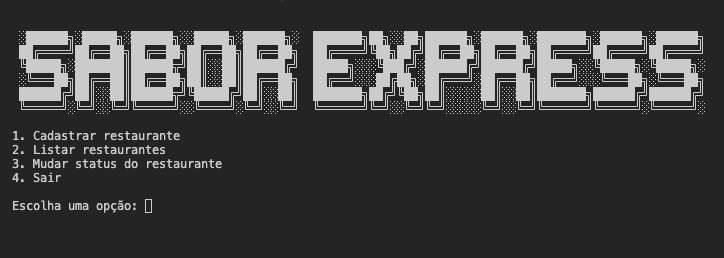

<h2 align = "center"> Sabor Express <h2> 
 By Bieelx 
 </h2>

Este repositório contém o código do projeto Sabor Express que foi criado com ajuda do curso da alura: Python: crie a sua primeira aplicação 

## 🚀 Tecnologias

Esse projeto foi desenvolvido com as seguintes tecnologias:
- Python

## 💻 Projeto

O "Sabor Express" é um projeto 100% desenvolvido em Python, com o objetivo de criar noções básicas de programação nessa linguagem. Ao longo do desenvolvimento, foquei em aplicar os conceitos fundamentais de Python, proporcionando uma experiência prática e acessível para iniciantes.

Esse projeto reflete meu aprendizado contínuo em Python e minha dedicação em explorar novas tecnologias.

